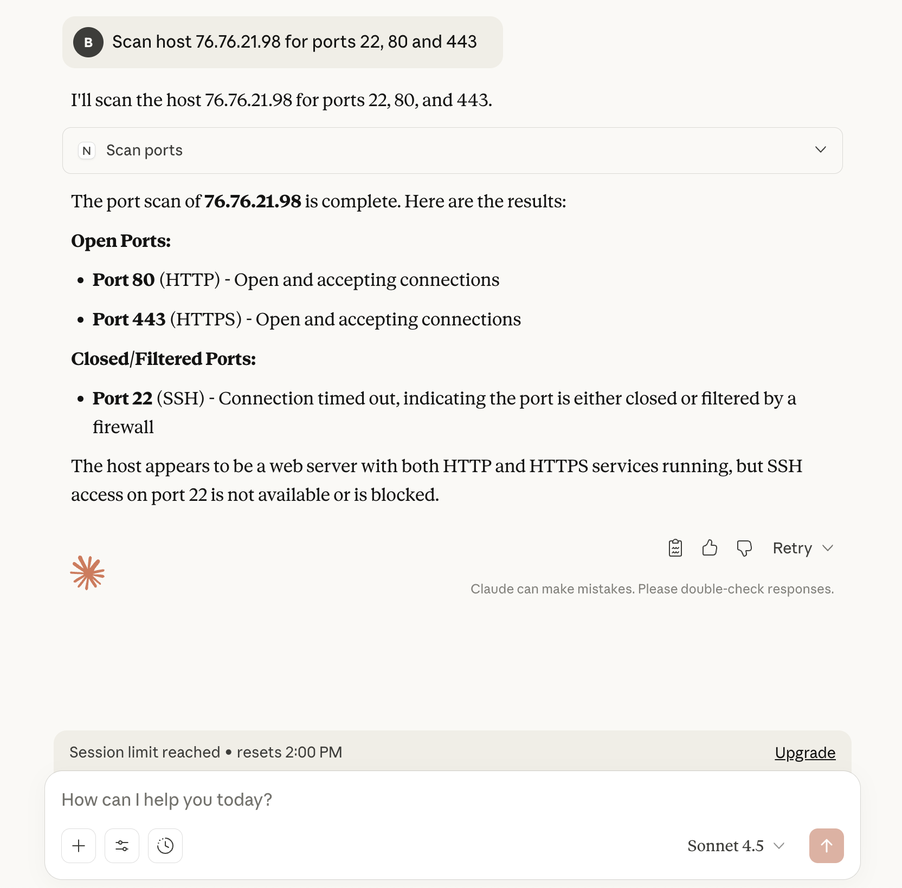

# Network Ops MCP

This is an aggregation of network operations tools that would be useful to IT professionals.

The idea is that tools like these could be built, aggregated and then run using natural language queries by field employees.

Tool List:
- get_network_configs
  - a wrapper to the `ifconfig` command line tool that returns local network configurations  
- scan_ports
  - given a host ip address and a list of ports or a port range, scan those ports to see which are open for connections


### Setup
This is currently running locally using Claude Desktop

1) In Claude Desktop -> Settings >> Developer - choose "Edit Config"
2) In the `claude_desktop_config.json` file, add a new mcp server:
```json
{
  "mcpServers": {
    "network-ops-mcp": {
      "command": "<path_to_venv>/network_ops/bin/python",
      "args": ["<path_to_mcp_code>network_ops_mcp/mcp_server.py"]
    }
  }
}
```
3) Restart Claude Desktop
4) Ensure the MCP connection is live with a query like `What tools can you access from network-ops-mcp`

### Examples

